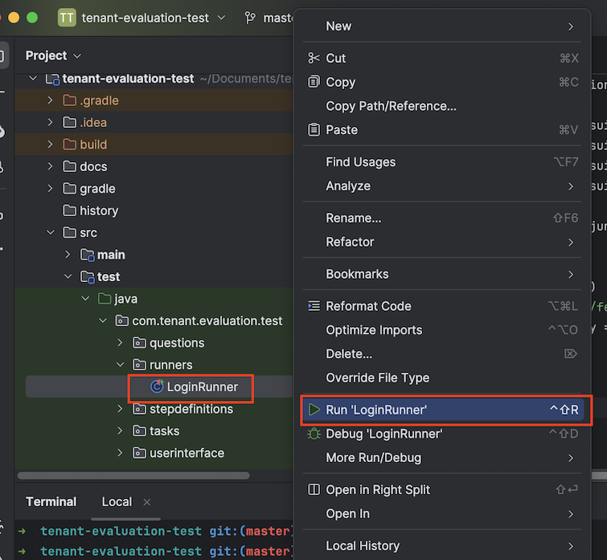
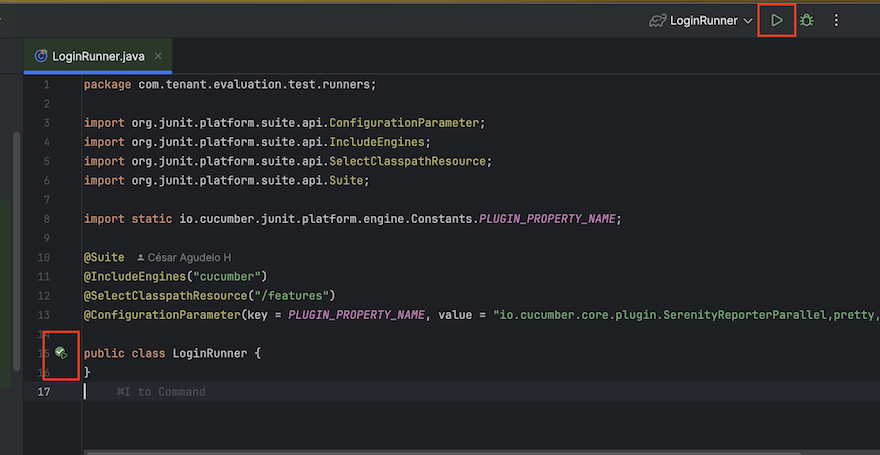
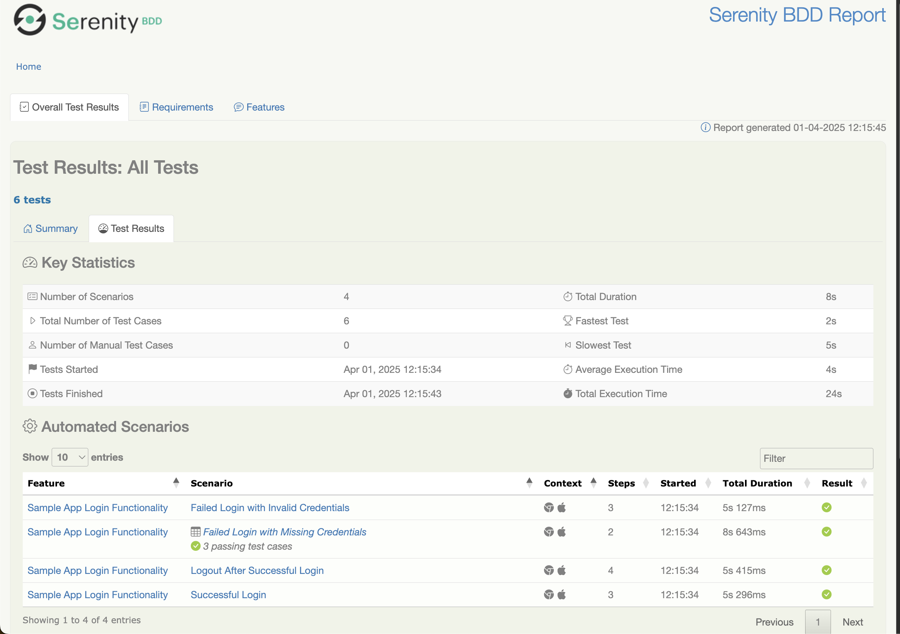

# Tenant evaluation test using Serenity-BDD with Cucumber y screenplay pattern

Serenity BDD, powered by the Screenplay Pattern, simplifies test automation by fostering 
a clear and maintainable framework. By structuring tests around actors, tasks, and questions, 
it encourages better collaboration and understanding among team members.

This pattern seamlessly integrates with Gherkin's Given-When-Then syntax, allowing for clear, 
business-readable scenarios. Cucumber then executes these scenarios, mapping Gherkin 
steps to the corresponding Screenplay actions and questions. This combination results in 
tests that are not only easy to understand by both technical and non-technical stakeholders 
but also robust, well-organized, and facilitate better collaboration within the development team.

Some of the key features of this project include:

- This project uses Serenity BDD with Cucumber and screenplay pattern, making the tests more
  readable and maintainable, especially as the application grows and new login-related features are added
- The project is configured to run tests in parallel and capture screenshots.
- The project uses the Serenity BDD framework to generate reports and capture screenshots.


## How to use

This is a GitHub repository. You can download in .zip format or clone it using the command:
```
https://github.com/cesaragudeloh/tenant-evaluation-test.git
```

## Installation

To execute this project, you'll need:

- Java Development Kit (JDK) version 17 or later - [download](https://adoptopenjdk.net/)
- Chrome web browser - [download](https://www.google.com/chrome/)
- The dependencies are managed with Gradle. You can see it in the build.gradle file.


## Execution

### Command line

The project can be executed by the command line using the gradle wrapper including inside, like this:

```
gradlew clean test aggregate            
```
`gradlew:` This is the Gradle Wrapper. It's a script (gradlew.bat for Windows, gradlew for macOS/Linux) 
that ensures the correct version of Gradle is used for the project, regardless of what's installed on the 
user's system. This helps maintain consistency across different development environments.

`clean:` This is a Gradle task that cleans the project's build directory. It removes all previously 
generated build files, such as compiled classes, JAR files, and test reports.
This is essential to ensure a fresh build and prevent any conflicts or unexpected behavior from leftover files.

`test:` This Gradle task executes the project's tests.
During the test execution, Serenity BDD will gather test results, generate reports, and capture screenshots 
(if configured).

`aggregate:` This is a Serenity BDD-specific Gradle task. It's used to combine the individual test reports 
generated by Serenity BDD into a single, comprehensive report.
If our tests are run in parallel or across multiple browsers, this task consolidates all the separate reports 
into a unified HTML report. This is the task that produces the final Serenity BDD reports.

### Integrated Development Environment (IDE)

If you prefer to use an Integrated Development Environment (IDE) like IntelliJ IDEA or Visual Studio Code, 
you can import this project as a Gradle project.

There's an example of how to execute the project using IntelliJ IDEA:

Open IntelliJ IDEA.

Import the project as a Gradle project.

Run the project. Located the runner class in the `src/test/java/com/tenant/evaluation/test/runners` directory.

Do right click in the runner class and select `Run`.




You can also run the project using play buttons




The tests will be executed and the results will be displayed in the console.
Adiccionally, results and evidence generated during test execution are located in the following directory:

```
$(Repository.Name)/target/site/serenity
```


## Logging, screenshot and reports configuration

Serenity BDD provides a rich set of features to configure logging, screenshots, and reports.
By adjusting the serenity.take.screenshots property (src/test/resources/serenity.properties) 
you can control the granularity of screens. The options available are: 

- `BEFORE_AND_AFTER_EACH_STEP` (default): Captures screenshots before and after each step.
- `FOR_EACH_ACTION`: Captures screenshots for each web element action.
- `FOR_FAILURES`: Captures screenshots only when a test fails.
- `DISABLED`: Disables screenshot capture.
- `AFTER_EACH_STEP`: Captures screenshots after each step.
- `DISABLED`: no screenshots.

Combined with Serenity’s live documentation, which automatically generates comprehensive reports 
from your test executions, this configuration ensures you have both precise visual feedback and 
rich, real-time documentation tailored to your project’s needs.